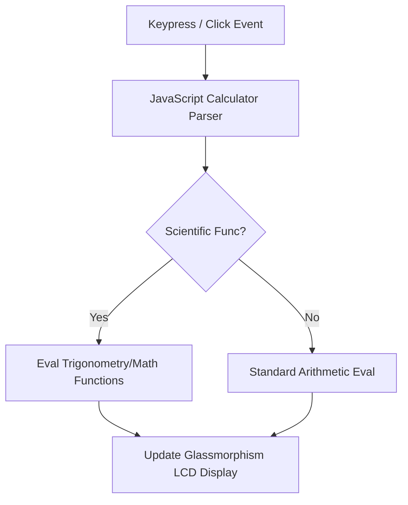

<!-- ========== NEW: ANIMATED WAVE HEADER ========== -->
<!-- ========== NEW: TYPING ANIMATION INTRO ========== -->

  

<!-- ========== NEW: AUTHOR & ARCHITECT SECTION ========== -->
## 👨‍💻 Author & Architect

<table>
<tr>
<td align="center" width="160">
  <a href="https://github.com/Sadique721">
     
    <b>Md Sadique Amin</b> 
    Backend Java Developer
  </a>
</td>
<td>

**Md Sadique Amin** — Backend Java Developer.

- 🔗 GitHub: [@Sadique721](https://github.com/Sadique721)
- 📧 Email: mdsadiqueamin721786@gmail.com
- 🏗️ Built: Enterprise BSS-OSS Telecom Suite, Backend Java Developer, IR Interconnect & Roaming

</td>
</tr>
</table>

<!-- ========== NEW: SYSTEM DIAGRAM SECTION ========== -->
## 📊 System Architecture & Workflow

---

# Advanced-Scientific-Calculator
🔢 Just Built an Advanced Scientific Calculator with Pure JavaScript!  This project features: ✅ 15+ Scientific Functions (trigonometry, logarithms, exponents) ✅ Modern UI with interactive animations ✅ Full Keyboard Support for efficient calculations ✅ Calculation History tracking

# 🧮 Advanced Scientific Calculator

A feature-rich calculator with scientific functions, history tracking, and keyboard support.

## ✨ Features
- **Basic & Scientific Operations**: +, -, ×, ÷, %, √, sin, cos, tan, log, factorial, etc.
- **Modern UI**: Gradient background with responsive design
- **Interactive Elements**: Button animations and hover effects
- **Calculation History**: Displays previous operations
- **Keyboard Support**: Full keyboard bindings

## 🎥 Demo

## 🛠️ Tech Stack
mermaid
graph LR
    A[Frontend] --> B(HTML5)
    A --> C(CSS3 Grid/Flexbox)
    A --> D(JavaScript ES6+)
    A --> E[No Dependencies]

✨ Swipe → See my Scientific Calculator in action!
[Carousel: 1.Main UI 2.Scientific Functions 3.Keyboard Demo]

🔥 Features:
• All basic + advanced math operations
• Smooth button animations
• Dark mode UI with purple gradient

Built with:
💻 Pure JavaScript (no libraries!)
🎨 Custom CSS transitions
⌨️ Full keyboard support

<!-- ========== NEW: FOOTER WAVE ANIMATION ========== -->

  

